# QuanTriage — A Clinically-Aware Quantum Cancer Triage Classifier


<p align="center">
  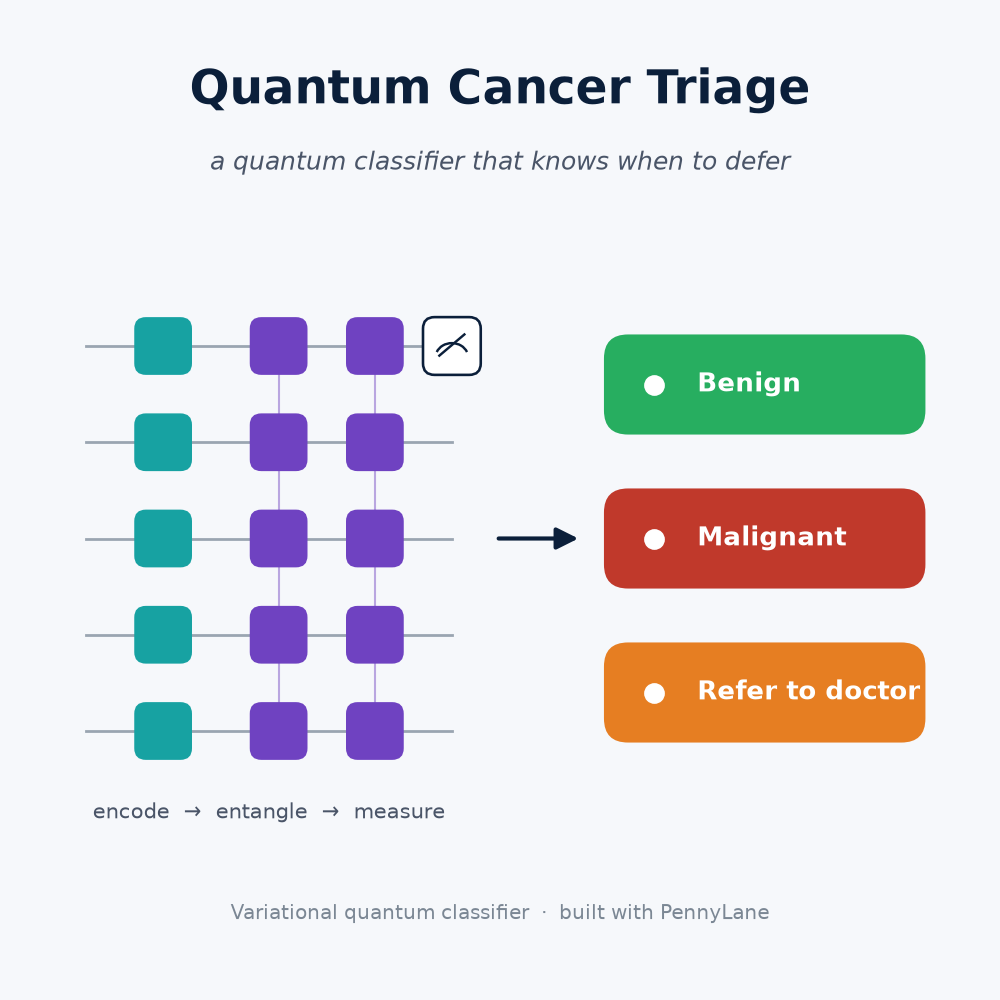
</p>

A hybrid **quantum machine learning** project built with [PennyLane](https://pennylane.ai/).
It trains a **variational quantum classifier** to distinguish malignant from benign breast
tumors — and, unlike most QML demos that stop at a single accuracy number, it behaves like a
tool you'd actually want near a clinic:

1. **It knows when it doesn't know.** Low-confidence cases are *referred to a doctor* instead
   of guessed (selective prediction / abstention).
2. **It's tuned to not miss cancer.** The decision threshold is chosen so that missing a
   malignancy is treated as far costlier than a false alarm (cost-sensitive thresholding).
3. **It's stress-tested on noisy "hardware."** The trained model is re-evaluated on a noisy
   quantum simulator that mimics real-device decoherence.
4. **It explains itself.** Permutation importance shows which cell-nucleus measurements drive
   the predictions.

Everything runs on a **simulator** — no quantum hardware required — and a full run finishes in
about **30 seconds** on a laptop.

---

## What is a variational quantum classifier?

```
 features ──▶ AngleEmbedding ──▶ StronglyEntanglingLayers ──▶  ⟨Z₀⟩  ──▶  p(malignant)
              (encode the data    (trainable rotation           (measure     = (1 − ⟨Z⟩)/2
               into qubit angles)  angles = the "weights")        qubit 0)
```

Classical data is *encoded* into a quantum state, an *entangling* circuit of trainable
rotations transforms it, and a single qubit measurement is read out as a probability. Training
adjusts the rotation angles by gradient descent (binary cross-entropy) — the same idea as
training a tiny neural network, but the hidden layer is a set of entangled qubits.

The model is wrapped as a scikit-learn estimator, so it plugs directly into standard tooling
(`permutation_importance`, scoring, etc.) and into an honest side-by-side comparison with
classical baselines.

---

## Quickstart

```bash
cd quantum-ml-pennylane
python3.12 -m venv .venv
.venv/bin/pip install -r requirements.txt
.venv/bin/python src/main.py
```

> Use **Python 3.12** — PennyLane does not yet ship wheels for 3.14.

Tune the model from the CLI:

```bash
.venv/bin/python src/main.py --qubits 8 --layers 6 --epochs 60 --cost-ratio 10
```

| flag | meaning | default |
|---|---|---|
| `--qubits` | qubits = number of (named) features used | 6 |
| `--layers` | variational layers (model capacity) | 4 |
| `--epochs` | training epochs | 40 |
| `--cost-ratio` | how many times worse a missed cancer is than a false alarm | 10 |
| `--confidence` | abstain below this confidence | 0.85 |
| `--noise-levels` | depolarizing-noise sweep | 0 0.01 0.03 0.05 0.1 |

### Interactive dashboard (GUI)

A [Streamlit](https://streamlit.io/) dashboard wraps the model in an interactive UI:

```bash
.venv/bin/streamlit run app.py
```

- **Predict a patient** — move sliders for real clinical measurements (or load an example
  malignant/benign patient) and get a live verdict: malignant, benign, or *refer to a doctor*.
- **Model performance** — quantum vs. classical metrics, confusion matrix, ROC, training curve.
- **Trust & robustness** — selective-prediction stats, noise-robustness and feature-importance charts.
- **3-D tumor scan** — a *real* brain-MRI volume with a radiologist-drawn tumor segmentation,
  reconstructed as a true 3-D surface (marching cubes), colored by MRI intensity, rotatable and
  animated, with the tumor's "state" quantified by real radiomics (volume, sphericity, elongation,
  intensity heterogeneity). This tab also **connects imaging to the quantum model**: the radiomics
  are angle-encoded into the quantum circuit (shown live), alongside a transparent rule-based risk
  indicator. A *valid* imaging-based quantum prediction needs training on a labeled radiomics
  dataset — see [imaging/quantum_imaging.py](imaging/quantum_imaging.py) (`QuantumRadiomicsClassifier`).
- **Cancer types** — trains the 5-type quantum classifier on the real TCGA pan-cancer data and
  shows accuracy vs. classical, per-type metrics, and an interactive confusion matrix.
- The sidebar's *cost-of-a-missed-cancer* and *confidence* sliders update everything live, so you
  can watch the sensitivity-vs-false-alarm tradeoff move in real time. The quantum circuit trains
  once (cached); interactions after that are instant.

<p align="center">
  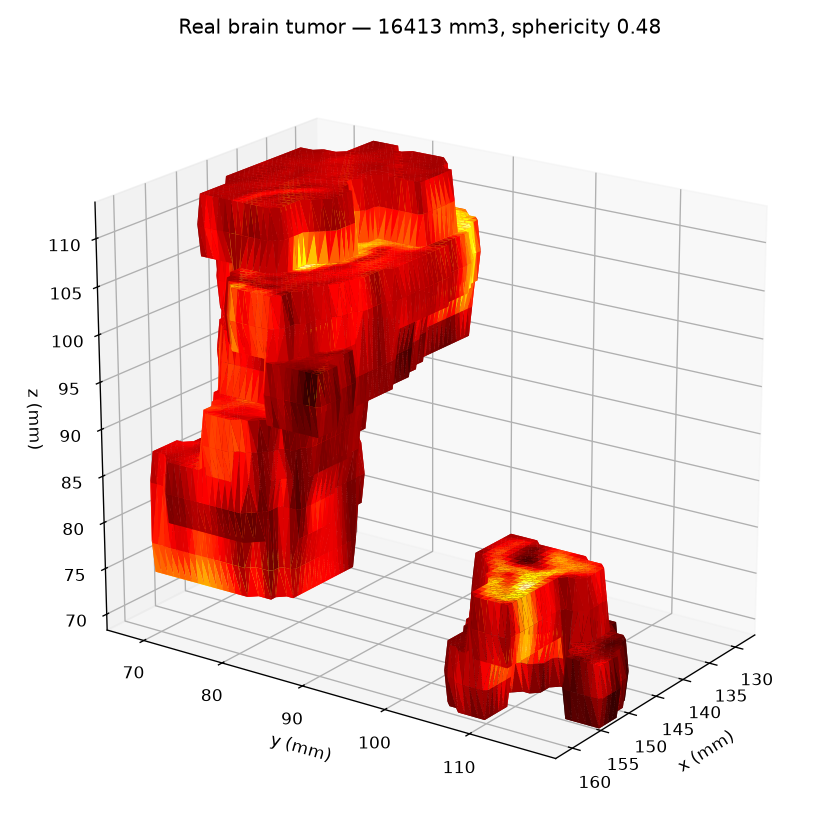
</p>

> **Honest scope note.** The 3-D scan is a *real* segmentation rendered and quantified — not a
> stylized shape — but it is **not** a quantum prediction on the scan. The quantum model is the
> tabular diagnostic; linking it to imaging (classifying from radiomics/voxels) is the roadmap.
> Generate a standalone interactive version with `python imaging/tumor3d.py` (writes
> `results/tumor_3d.html`).

---

## Example results (default settings, seed 42)

**Quantum vs. classical** on the held-out test set:

| model | accuracy | sensitivity | specificity | AUC |
|---|---|---|---|---|
| quantum (thr 0.50) | 0.930 | 0.849 | 0.978 | 0.991 |
| **quantum (cost-tuned, thr 0.27)** | 0.909 | **1.000** | 0.856 | 0.991 |
| logistic regression | 0.965 | 0.925 | 0.989 | 0.997 |
| SVM (RBF) | 0.958 | 0.906 | 0.989 | 0.997 |

After cost-sensitive tuning the quantum model **catches every malignancy in the test set
(0 missed cancers)**, trading a handful of false alarms for safety — the right call for a
screening tool. Classical baselines still win slightly on raw accuracy, which the project
reports honestly: quantum ML is competitive here, not yet superior.

**Selective prediction:** at a 0.85 confidence cutoff the model decides ~59% of cases with
**100% accuracy on the cases it keeps**, and refers the rest to a human.

**Noise robustness:** accuracy degrades gracefully (≈0.92 → 0.74) as depolarizing noise
increases — useful intuition for what real hardware would cost you.

Your exact numbers will vary with the flags and seed.

---

## Results gallery

| | |
|---|---|
| **Cost-tuned to catch every cancer** | **Refers uncertain cases to a doctor** |
| 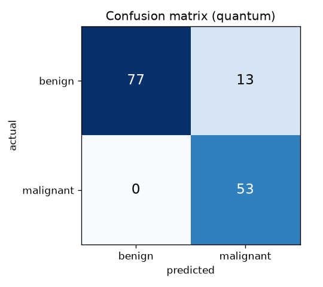 | 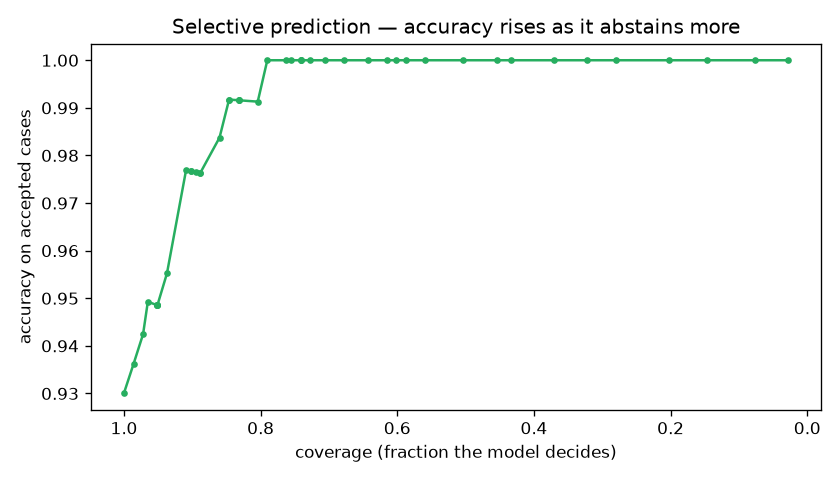 |
| **Quantum vs. classical (ROC)** | **Survives quantum noise** |
| 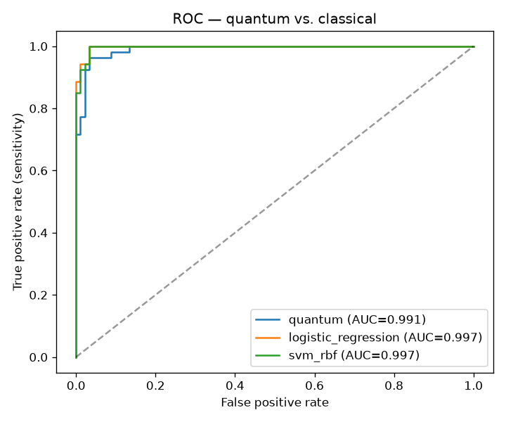 | 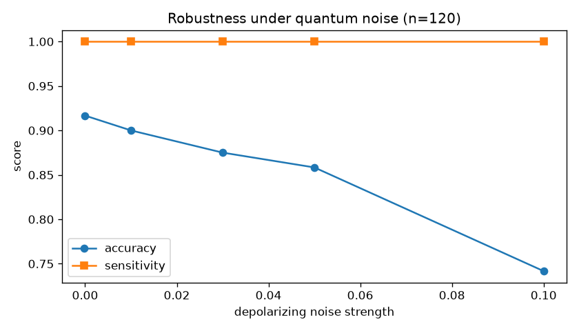 |
| **Explains which measurements matter** | **Trains in seconds** |
| 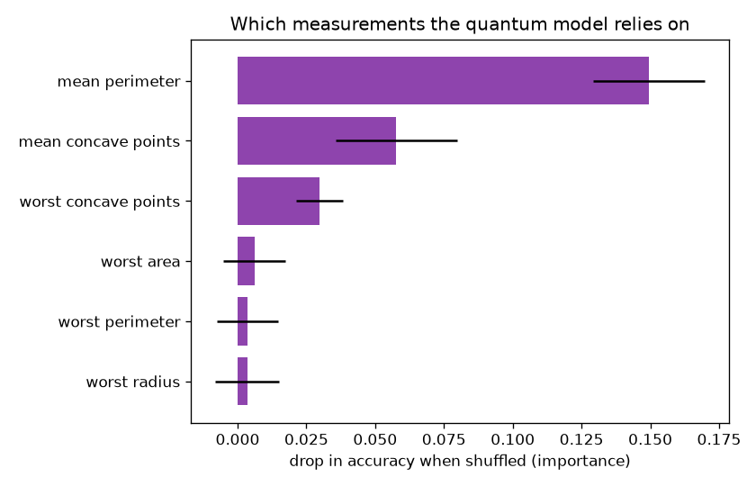 | 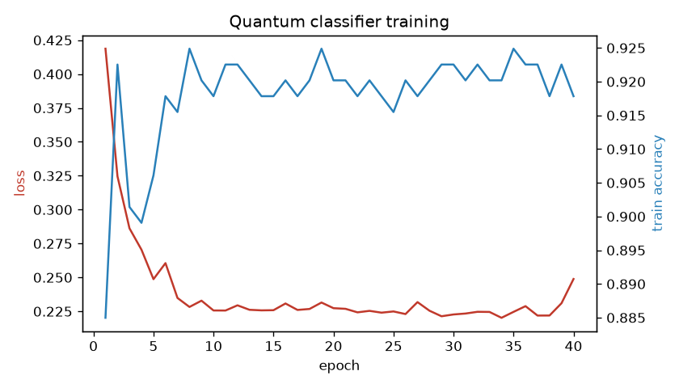 |

---

## Beyond breast cancer — multiple tumor types

The pipeline isn't limited to one cancer. A small **dataset registry**
([src/datasets.py](src/datasets.py)) runs the quantum approach on multiple real datasets, and a
**multi-class quantum classifier** ([src/multiclass_model.py](src/multiclass_model.py)) classifies
*which* of several tumor types a sample is:

```bash
.venv/bin/python src/multicancer.py                      # pan-cancer, 5 tumor types
.venv/bin/python src/multicancer.py --dataset breast_cancer
```

On the **TCGA pan-cancer RNA-seq** dataset (801 gene-expression profiles, downloaded on first
use), it classifies into five real tumor types — **breast (BRCA), kidney (KIRC), lung (LUAD),
prostate (PRAD), colon (COAD)** — reaching **~89% accuracy** across all five (classical baseline
~0.99). Two details that mattered:

- **Per-class feature selection** — a global ANOVA F-test starves the smallest class (colon) of
  marker genes; selecting genes per tumor type (one-vs-rest) is what lets colon be classified at all.
- **Tempered class weighting** — softens the breast/colon imbalance without collapsing the model.

<p align="center">
  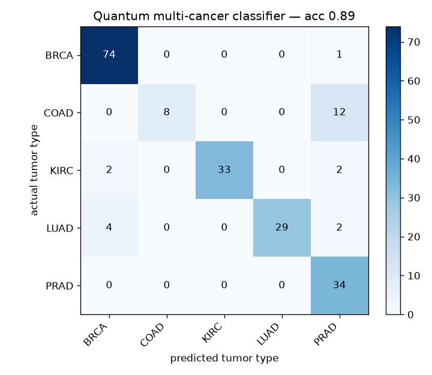
</p>

Colon remains the hardest type (smallest sample, transcriptomically close to the other
adenocarcinomas) — an honest limitation the confusion matrix makes plain.

---

## Live training studio — train on your own (Kaggle) data

A dedicated app ([studio.py](studio.py)) to **bring your own CSV and train the quantum classifier
live**:

```bash
.venv/bin/streamlit run studio.py
```

Upload a dataset (e.g. from Kaggle), pick the target column, and watch **every epoch** — loss and
accuracy curves, the **live state of the model** (weight norm, per-layer stats, the circuit) — then
see test metrics, a confusion matrix, and **download a checkpoint**. Binary vs. multi-class is
auto-detected. The same `on_epoch` hook and `save_checkpoint`/`load_checkpoint` live on the
quantum estimators in [src/quantum_model.py](src/quantum_model.py).

---

## Tumor localization — *where* is the cancer (U-Net, GPU-accelerated)

Classification says *what*; localization says *where*. A **2-D U-Net**
([segmentation/unet.py](segmentation/unet.py)) is trained to produce a per-pixel tumor mask, then
predicted masks flow into the 3-D renderer. It trains on the GPU via PyTorch's **Metal (MPS)
backend on Apple Silicon** — on an M5 a synthetic pipeline check hits **Dice 0.998 in ~16 s**.

```bash
# validate the pipeline on synthetic data (no download needed)
python segmentation/train_seg.py --epochs 25
python segmentation/predict_seg.py          # writes assets/segmentation_demo.png

# train on real MRI — Medical Segmentation Decathlon brain-tumour volumes:
python segmentation/train_seg.py --msd_root data_cache/msd/Task01_BrainTumour --n_volumes 60 --epochs 30

# or any images + masks folders (e.g. a Kaggle dataset):
python segmentation/train_seg.py --images_dir path/to/images --masks_dir path/to/masks --epochs 40
```

There's also a **live "Localization (train)" tab** in the Streamlit app: pick the data source,
hit train, and watch loss + Dice update per epoch on the GPU, then see predicted masks.
[segmentation/msd_data.py](segmentation/msd_data.py) turns the 3-D multimodal MSD volumes into
2-D FLAIR slices with binary tumor masks.

Trained on **real brain MRI** (Medical Segmentation Decathlon, 50 volumes → 1,032 slices, 18
epochs, ~2 min on an M5 GPU) it reaches **val Dice 0.755**, and **Dice 0.845 on a fully held-out
case** the model never saw:

<p align="center">
  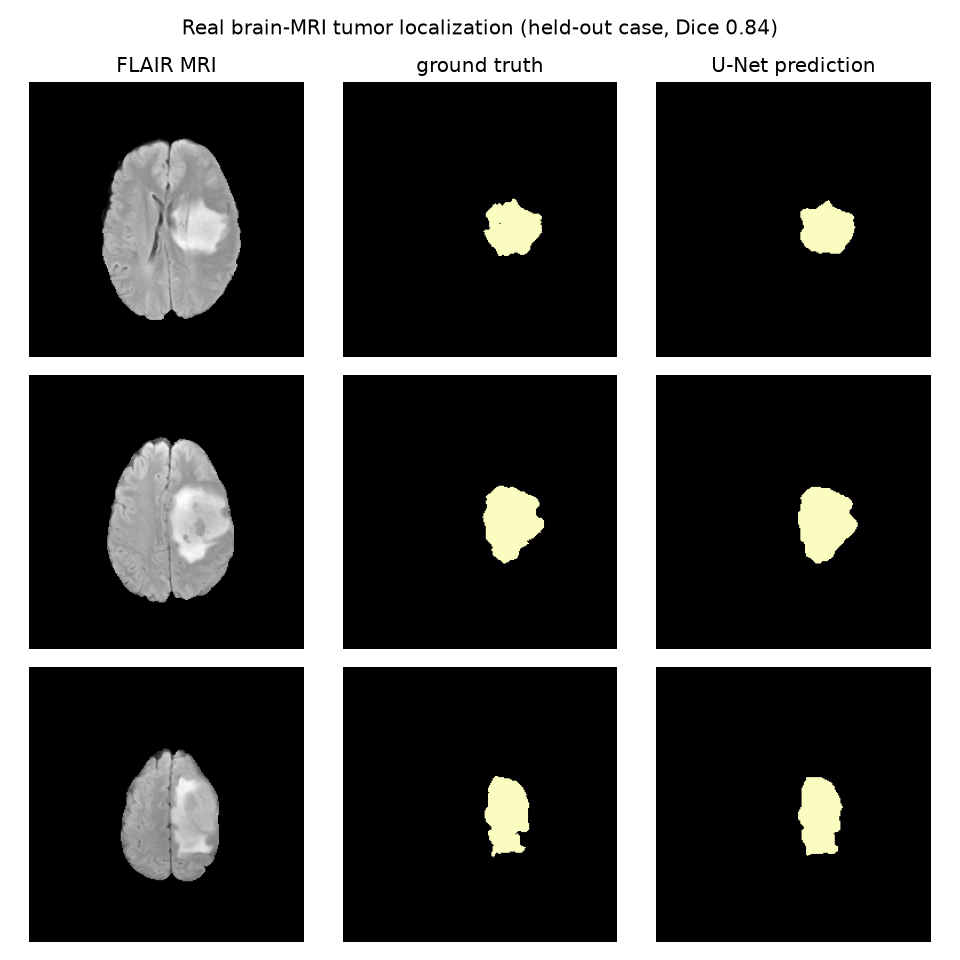
  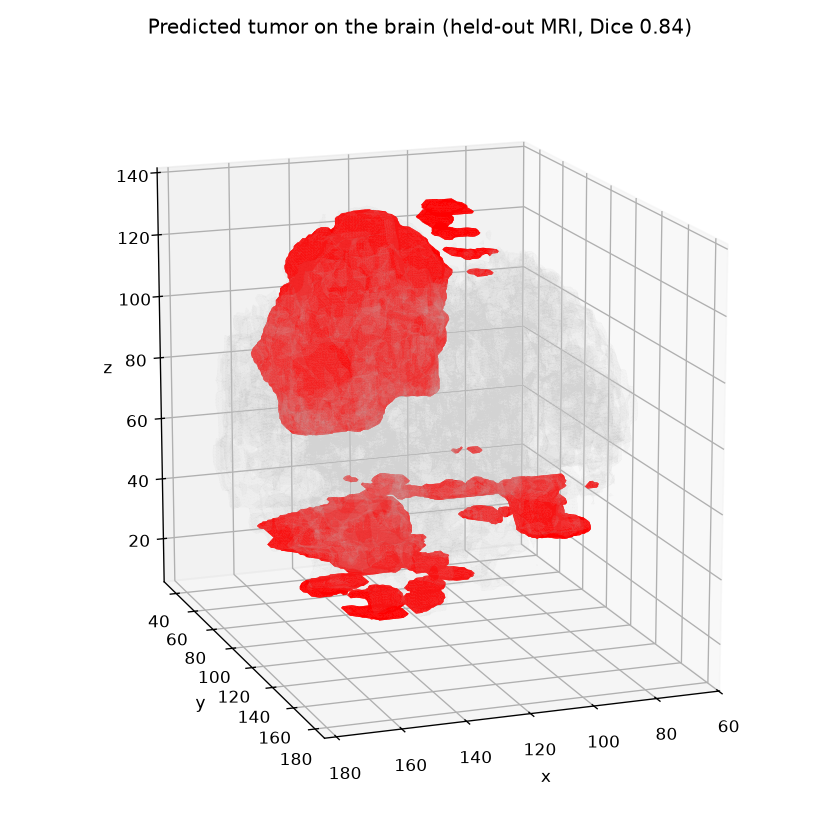
</p>

The U-Net's predicted mask (right column) closely matches the radiologist ground truth (middle),
and the predicted tumor renders **on the organ** — translucent brain + the located tumor — so you
see *where* it sits, interactive and rotatable in the app.

### Multi-modal, multi-class sub-region segmentation

Scaling up to **all four MRI modalities** (FLAIR + T1 + T1ce + T2) and **multi-class output** —
the clinical BraTS sub-regions — via [segmentation/multimodal.py](segmentation/multimodal.py):

```bash
python segmentation/multimodal.py --n_volumes 60 --epochs 22
```

On real MRI (60 volumes, ~3 min on M5 GPU) it reaches validation Dice **WT 0.857 · TC 0.712 ·
ET 0.751**, and on a fully held-out case **WT 0.910 · TC 0.856 · ET 0.851** — at the ~0.90
whole-tumor mark:

<p align="center">
  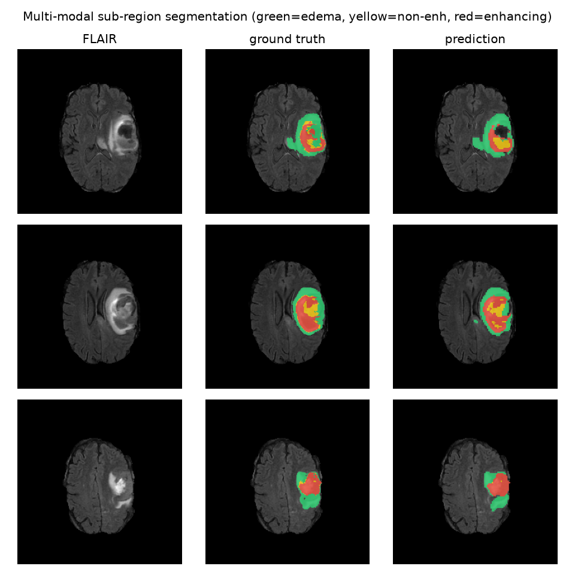
</p>

It separates **edema (green), non-enhancing (yellow), and enhancing (red)** tumor — the regions
clinicians actually distinguish. Shipped as `models/unet_multimodal_brats.pt`.

- [segmentation/seg_data.py](segmentation/seg_data.py) — flexible `images/ + masks/` loader (the
  common Kaggle layout) plus a synthetic generator for pipeline validation.
- [segmentation/train_seg.py](segmentation/train_seg.py) — MPS-accelerated training with **live
  per-epoch loss + Dice** and best-checkpoint saving.
- [segmentation/predict_seg.py](segmentation/predict_seg.py) — inference, whole-volume
  segmentation, and a 3-D render of the **predicted** tumor.

> **Honest status.** This is **real** localization on **real** MRI (Dice 0.845 on a held-out case)
> — but a lightweight 2-D FLAIR-only U-Net on 50 volumes. State-of-the-art whole-tumor Dice (~0.90)
> uses full 3-D models, all four MRI modalities, and the whole dataset; scaling up is
> straightforward with the same code. The synthetic check (`assets/segmentation_demo.png`, Dice
> 0.998) just validates the pipeline. **Not a medical device.**

---

## Reading the output

The run prints a full console report and writes artifacts to `results/`:

| file | what it shows |
|---|---|
| `training_curve.png` | loss ↓ and train accuracy ↑ over epochs |
| `roc_curve.png` | ROC for quantum vs. each classical baseline |
| `confusion_matrix.png` | quantum confusion matrix at the cost-tuned threshold |
| `selective_prediction.png` | risk–coverage curve: accuracy rises as the model abstains more |
| `noise_robustness.png` | accuracy & sensitivity vs. quantum-noise strength |
| `feature_importance.png` | which measurements the model relies on |
| `metrics.json` | every number above, machine-readable |

---

## Project layout

```
src/
├── data.py             load breast-cancer data, select top-k NAMED features, scale, split
├── quantum_model.py    the variational circuit, sklearn-style estimator, + noisy variant
├── baselines.py        classical logistic regression + RBF SVM on the same features
├── evaluation.py       metrics, cost threshold, selective prediction, noise, importance, plots
├── main.py             orchestrates the breast-cancer pipeline and prints the report
├── datasets.py         registry of real cancer datasets (breast + pan-cancer RNA-seq)
├── multiclass_model.py multi-class variational quantum classifier (N tumor types)
└── multicancer.py      train/evaluate across multiple tumor types + classical baseline
imaging/
├── tumor3d.py          real MRI + tumor segmentation -> interactive animated 3-D render
└── quantum_imaging.py  bridge: imaging radiomics -> quantum classifier (+ trainable head)
segmentation/
├── unet.py             2-D U-Net for tumor localization (where is it)
├── seg_data.py         images/masks loader (Kaggle-style) + synthetic generator
├── train_seg.py        GPU (MPS) training with live epochs + Dice + checkpoints
└── predict_seg.py      inference, whole-volume segmentation, 3-D render of prediction
app.py                  Streamlit dashboard (predict · performance · trust · 3-D scan · types)
```

**Data note:** scikit-learn encodes the target as malignant=0/benign=1; we relabel so
**malignant = 1 (positive class)**, which makes "sensitivity/recall" mean "fraction of real
cancers caught." We use feature *selection* (not PCA) so the inputs stay human-readable named
measurements, keeping the interpretability step clinically meaningful.

---

## Extending it

- **Bigger model:** raise `--qubits` / `--layers` (cost scales with simulator size).
- **Different encoding:** swap `AngleEmbedding` for `AmplitudeEmbedding` or a *data re-uploading*
  ansatz for more expressivity.
- **Real quantum hardware:** PennyLane has plugins for IBM Quantum (`pennylane-qiskit`) and
  AWS Braket (`pennylane-braket`) — point the device at real backends instead of `default.qubit`.
- **PyTorch hybrid:** wrap the circuit in `qml.qnn.TorchLayer` to stack it with classical layers.

---

## Disclaimer

This is an educational research project, **not a medical device**. It must not be used for
real diagnosis or clinical decisions.
